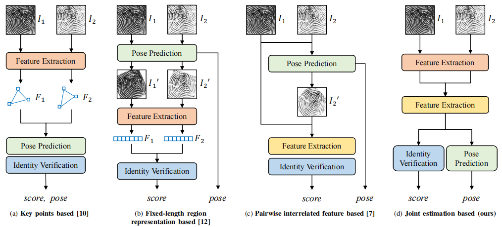

<!--
 * @Description: 
 * @Author: Xiongjun Guan
 * @Date: 2024-05-24 10:59:39
 * @version: 0.0.1
 * @LastEditors: Xiongjun Guan
 * @LastEditTime: 2024-11-04 15:49:55
 * 
 * Copyright (C) 2024 by Xiongjun Guan, Tsinghua University. All rights reserved.
-->
# JIPNet

<a src="https://img.shields.io/badge/cs.CV-2405.03959-b31b1b?logo=arxiv&logoColor=red" href="https://arxiv.org/abs/2405.03959"> 
    
</a> 

### 💬 This repo is the official implementation of:
- ***arXiv 2024***: [Joint Identity Verification and Pose Alignment for Partial Fingerprints](https://arxiv.org/abs/2405.03959) 

[Xiongjun Guan](https://xiongjunguan.github.io/), Zhiyu Pan, Jianjiang Feng, Jie Zhou

<br>

## Introduction
Currently, portable electronic devices are becoming more and more popular. For lightweight considerations, their fingerprint recognition modules usually use limited-size sensors. However, partial fingerprints have few matchable features, especially when there are differences in finger pressing posture or image quality, which makes partial fingerprint verification challenging. Most existing methods regard fingerprint position rectification and identity verification as independent tasks, ignoring the coupling relationship between them -- relative pose estimation typically relies on paired features as anchors, and authentication accuracy tends to improve with more precise pose alignment. In this paper, we propose a novel framework for joint identity verification and pose alignment of partial fingerprint pairs, aiming to leverage their inherent correlation to improve each other. To achieve this, we present a multi-task CNN (Convolutional Neural Network)-Transformer hybrid network, and design a pre-training task to enhance the feature extraction capability. Experiments on multiple public datasets (NIST SD14, FVC2002 DB1A & DB3A, FVC2004 DB1A & DB2A, FVC2006 DB1A) and an in-house dataset show that our method achieves state-of-the-art performance in both partial fingerprint verification and relative pose estimation, while being more efficient than previous methods.

The overall flowchart of our proposed algorithm is shown as follows.
<br>
<p align="center">
     <br />
</p>
<br>

The structure of **JIPNet** (the name `JIP` stands for **J**oint **I**dentity Verification and **P**ose Alignment for Partial Fingerprints) is shown as follows.
<br>
<p align="center">
     <br />
</p>
<br>

## Notice :exclamation:
Model weights and data will be released gradually after this paper is officially accepted.

<br>

## News :bell:
- **[Nov. 1 2024]** Code is coming.

<br>
  
## Requirements
```shell
einops==0.8.0
numpy==2.1.3
opencv_contrib_python==4.10.0.84
opencv_python==4.8.1.78
PyYAML==6.0.2
scipy==1.14.1
timm==0.9.12
torch==2.1.2
tqdm==4.66.1
```

<br>

## Data preparation

The file structure in the example code is as follows:
```shell
root_path/examples/
├── data
|   ├── 0_1.png
|   ├── 0_2.png
|   ├── ......
├── result
|   ├── method
|   |   ├── 0.png
|   |   ├── 0.txt
|   |   ├── ......
```
Input paired images (`ftitle_1.png, ftitle_2.png`), output aligned results (`ftitle.png`) and classification probabilities/relative pose vectors (`ftitle.txt`).


The test data is available from this [link](https://drive.google.com/drive/folders/17z14S86t9cs89rYL4_WkuJxek8Aaks1q?usp=sharing).

<br>

## Run
* **test JIPNet**
    ```shell
    python inference.py
    ```

<br>

:zap: The following models are reproduced by referring to corresponding papers. Some of them have been adjusted for partial fingerprint scenarios, so there may be some differences from the performance reported in original experiments.

* **test PFVNet**
    >Z. He, J. Zhang, L. Pang, and E. Liu, “PFVNet: A partial fingerprint verification network learned from large fingerprint matching,” IEEE Transactions on Information Forensics and Security, vol. 17, pp. 3706–3719, 2022.
    
    ```shell
    python inference_PFVNet.py
    ```

* **test AFRNet**
    >S. A. Grosz and A. K. Jain, “AFR-Net: Attention-driven fingerprint recognition network,” IEEE Transactions on Biometrics, Behavior, and Identity Science, vol. 6, no. 1, pp. 30–42, 2024.
    ```shell
    python inference_AFRNet.py
    ```

* **test DesNet**
    >S. Gu, J. Feng, J. Lu, and J. Zhou, “Latent fingerprint registration via matching densely sampled points,” IEEE Transactions on Information Forensics and Security, vol. 16, pp. 1231–1244, 2021.
    ```shell
    python inference_DesNet.py
    ```

* **test DeepPrint**
    >J. J. Engelsma, K. Cao, and A. K. Jain, “Learning a fixed-length fingerprint representation,” IEEE Transactions on Pattern Analysis and Machine Intelligence, vol. 43, no. 6, pp. 1981–1997, 2021.
    ```shell
    python inference_DeepPrint.py
    ```
    
* **test A-KAZE**
    >S. Mathur, A. Vjay, J. Shah, S. Das, and A. Malla, “Methodology for partial fingerprint enrollment and authentication on mobile devices,” in 2016 International Conference on Biometrics (ICB), 2016, pp. 1–8.
    ```shell
    python inference_AKAZE.py
    ```

<br>

## Citation
If you find this repository useful, please give us stars and use the following BibTeX entry for citation.
```
@article{guan2024joint,
  author={Guan, Xiongjun and Pan, Zhiyu and Feng, Jianjiang and Zhou, Jie},
  journal={arXiv preprint arXiv:2405.03959},
  title={Joint Identity Verification and Pose Alignment for Partial Fingerprints}, 
  year={2024},
```

<br>

## License
This project is released under the MIT license. Please see the LICENSE file for more information.

<br>

## Contact me

If you have any questions about the code, please contact Xiongjun Guan gxj21@mails.tsinghua.edu.cn
